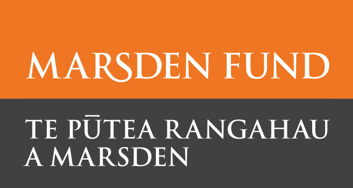

   

What does the future hold for exploited marine populations under climate change and continued high fishing impacts? Human impacts from climate change and intensive fishing are affecting even the most remote ecosystems. In a rapidly changing ocean, fishing induced changes in marine ecosystems may substantially impact the resilience of many marine populations, altering their response to intensifying stressors related to climate change. 
  

For this project, I will further use data on population abundance and dynamics from regional and global databases together with novel size-based models to quantify the impact of fishing on populations and ecosystems subjected to changing ocean conditions. As a first step, idealised size-based models will allow me to explore the cumulative and interactive effects of changing ocean conditions and fishing induced impacts. 
  

I will then connect size based models to data from global fisheries databases to make predictions about the future of exploited marine ecosystems under climate change and quantify the resulting impacts on global food security. This research will thus provide substantial a contribution to our knowledge and awareness about long-term human impacts on marine ecosystems and biodiversity. Implications for global food security will inform future national and international marine resources policies.
 
This project is funded by the Marsden fund, grant no. DFG-14-001.
   

